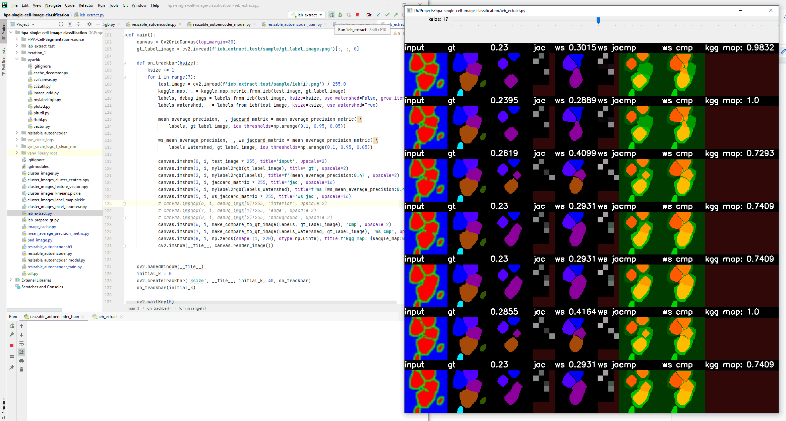

The screenshot below is an example of visualization tooling I used to debug a segmentation issue.
The leftmost column is the input image, which is the image of properly separated cells with slight modifications that break the perfect separation.
The second column is the ground truth. The purpose of this code is to recover the segmentation of all cells even under the imperfect separation in the blue-green-red image.
Rest of the columns provide some insights into the process.
The tool is interactive, allowing to adjust the kernel size that is used for initial watershed seeding.
The jaccard matrix visualisaztion (titled 'jac') allows a glance into overlap with the ground truth.

